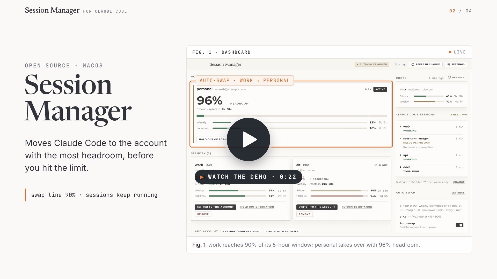

<p align="center">
  
</p>

<h1 align="center">Session Manager for Claude Code</h1>

<p align="center">
  A macOS menu bar app for people who run Claude Code on more than one Claude Pro or Max account.<br>
  It watches every account's 5-hour and weekly usage limits and switches Claude Code<br>
  to the account with the most headroom before one of them rate-limits you.
</p>

<p align="center">
  <a href="https://github.com/aneesh-iyer29/claude-session-manager/actions/workflows/ci.yml"></a>
  <a href="https://github.com/aneesh-iyer29/claude-session-manager/releases/latest"></a>
  <a href="https://github.com/aneesh-iyer29/claude-session-manager/releases"></a>
  <a href="LICENSE"></a>
  
</p>

<p align="center">
  <a href="#install">Install</a> ·
  <a href="#first-run">First run</a> ·
  <a href="#auto-swap">Auto-swap</a> ·
  <a href="docs/USAGE.md">User guide</a> ·
  <a href="#faq">FAQ</a> ·
  <a href="docs/ARCHITECTURE.md">Architecture</a> ·
  <a href="CONTRIBUTING.md">Contributing</a>
</p>

<br>

[](https://aneesh-iyer29.github.io/claude-session-manager/#demo)

<p align="center"><sub>▶ <a href="https://aneesh-iyer29.github.io/claude-session-manager/#demo">Watch the 22-second demo</a> (with sound) · <a href="docs/demo.mp4">download the MP4</a></sub></p>

## What it does

| | |
| --- | --- |
| **Many Claude accounts, one dashboard** | Capture the account Claude Code is logged in with, or add more through a browser login. Each account gets a gauge showing its headroom and when its binding window resets. |
| **Session-first auto-swap** | When the active account's 5-hour session reaches its swap line, or the weekly window you chose (all models, Fable, or whichever is tighter) reaches its own, the app switches Claude Code to the account with the most headroom on the axis that ran out. Cooldown, margin, and a dry-run mode keep it from flapping. |
| **Texts you when Claude Code needs you** | Lists your open Claude Code sessions and, while you are away from the Mac, sends an iMessage through the Messages app when one is asking a question, waiting on a permission prompt, or done and waiting for you. |
| **One Codex account** | If the Codex CLI is logged in with ChatGPT, its 5-hour and weekly windows appear in the sidebar. Codex is never switched. |
| **Limit resets, tracked and spendable** | When Anthropic or OpenAI bank a usage-limit reset on an account, its card shows how many and when they expire. **Use reset**, then confirm, puts that account's 5-hour and weekly limits back to full. |
| **Menu bar first** | The tray item is a glance menu: a usage bar per window for every account, plus Open and Quit. Switching and settings live in the window, so the menu can never change anything by accident. |
| **Local only** | One user, no server, no telemetry. Nothing leaves your machine except the calls to Anthropic's and OpenAI's own APIs, and the iMessages you send yourself if you turn alerts on. |

## Install

### Download

Grab the DMG for your Mac from the [latest release](https://github.com/aneesh-iyer29/claude-session-manager/releases/latest), open it, and drag the app to Applications.

| Mac | File |
| --- | --- |
| Apple silicon | `Session.Manager-<version>-arm64.dmg` |
| Intel | `Session.Manager-<version>.dmg` |

> [!IMPORTANT]
> Builds are unsigned, so the first launch needs either right-click → **Open**, or:
>
> ```sh
> xattr -dr com.apple.quarantine "/Applications/Session Manager.app"
> ```

### Build it yourself

Requires Node 22 and macOS.

```sh
npm install
npm run dist          # → dist/Session Manager-<version>-arm64.dmg (and x64, and zips)
```

## First run

The dashboard opens empty with two ways to add an account:

1. **Capture current login** copies the credential Claude Code is using right now (from the macOS Keychain) and its identity (from `~/.claude.json`) into the app. Run `claude` and sign in first if you haven't.
2. **Log in with browser** opens claude.ai in your browser; after you approve, the app receives the token on `localhost:54545` and adds the account. Repeat for each account.

Whichever account matches the live Keychain credential is marked **active**.

## The dashboard


| Panel | What it shows |
| --- | --- |
| **Hero gauge** | The active account. The big number is the headroom of its *binding window*: the 5-hour session, or a weekly window once that is past the warn line and closer to its limit than the session (the week will run out before the session does). The reset countdown sits under it and the other windows are smaller meters. |
| **Standby cards** | Every other account with the same gauge at a smaller scale, a *Switch* button, and controls to hold it out of rotation, rename it, or remove it. |
| **Codex** | The Codex CLI account's 5-hour and weekly windows, with its own *Refresh* in the panel header (the toolbar's *Refresh Claude* polls only the Claude accounts). In API-key mode there is no usage endpoint, so the panel only says the CLI is configured. |
| **Claude Code sessions** | Every open Claude Code session and whether it is working or waiting on you, plus whether texts are going out. |
| **Auto-swap** | The policy's settings in one line, the last decision it made, and the arm switch. |
| **Settings** | Everything else, on its own full-window page (toolbar button or ⌘,): auto-swap behaviour, swap lines, the Claude Code hooks, session alerts, and general app options. |
| **Activity** | Switches, auto-swap decisions, logins, and errors, newest first. The newest twelve show; *Show more* unfolds the rest (up to a hundred). |

## Auto-swap

Every poll (default 5 min; standby accounts at most every 10 min, since the usage endpoint allows about 30 requests an hour per account) the app refreshes usage, then, if auto-swap is armed, runs the policy.

| Setting | Meaning |
| --- | --- |
| **5-hour swap at** (50–100, default 90) | The active account is *near limit* when its 5-hour session reaches this percent used. Keep a real buffer here: one heavy turn can move a session several points. |
| **Weekly swap at** (50–100, default 90) | The same line for the weekly and Fable weekly windows. These can be run nearly dry. |
| **Margin** (0–50, default 10) | A target must beat the active account by at least this much on the axis that hit: session headroom when the session did, weekly headroom when a weekly window did. Hysteresis against ping-pong. |
| **Cooldown** (default 300 s) | Minimum time between automatic switches. |
| **Strategy** | `best`: only switch when near limit, to the account with the most headroom. `consume_first`: prefer the account whose weekly window resets soonest, so nothing goes unused. |
| **Weekly limit** | Which weekly window counts: *All models* (the plain weekly limit, for when you run Opus), *Fable only* (the per-model window, `model:fable`), or *Whichever is tighter* (default). The model name is a setting for when the gating model changes. |
| **Dry run** | The policy runs and logs what it *would* do; nothing is switched. |

Accounts held out of rotation, or whose usage is unknown, are never targets. If nobody qualifies the decision is *blocked* and shows up in Activity.

### What a switch does

A switch writes the target credential to the Keychain and updates `oauthAccount` in `~/.claude.json`, taking Claude Code's own lock files first so a concurrent token refresh can't corrupt either. Before overwriting, the live credential is saved back into the outgoing account's slot so a token Claude Code rotated is not lost. Running Claude Code sessions pick up the new login on their next request.

### Live usage without polling

Install the status line feed from Settings → Claude Code and Claude Code hands the app its own rate-limit numbers on every message. The active account updates instantly and the usage endpoint is only asked about the Fable window, every 30 minutes, or every 5 once that window is within 10 points of its swap line. After a swap, status line data that still carries the previous login's numbers is recognised and ignored.

### Compact before the swap

Swapping mid-conversation costs one full re-cache of that conversation on the new account. Session Manager can install a small Claude Code `UserPromptSubmit` hook: when the active account reaches the warn line (default 80%), your next prompt is stopped once with "run `/compact` now", so the context is compacted before it moves. Install or remove it in Settings → Claude Code; details in the [user guide](docs/USAGE.md#compact-nudge).

## Texts when a session needs you

Install the session hooks from the *Claude Code sessions* panel and every open Claude Code session shows up with what it is doing. Enter your phone number or Apple ID email, press **Send test** (macOS asks once whether Session Manager may control Messages), and turn on **Text me when a session needs me**. When a session asks a question, hits a permission prompt, or finishes its turn, and it has waited two minutes with nobody touching the Mac, you get one iMessage from your own account. Nothing extra to install or sign up for. Details in the [user guide](docs/USAGE.md#claude-code-sessions-and-imessage-alerts).

## Menu bar and launch at login

The tray item is the code-bracket mark. Click it for a glance menu with usage bars for every account and Codex, plus Open Session Manager and Quit; all management stays in the window. Closing the window hides it; quit from the menu or with ⌘Q. *Show in Dock* off makes it a pure menu-bar app.

## Data and security

| Path | Contents |
| --- | --- |
| `~/Library/Application Support/Session Manager/settings.json` | settings |
| `.../accounts.json` | account metadata, no secrets |
| `.../credentials/<id>.json` | one credential per account, file mode 0600, directory 0700 |
| `.../usage.json`, `state.json`, `events.jsonl` | last usage, active id, activity log |
| `.../sessions/` | one small file per Claude Code session and hook event: session id, folder, and at most the question asked (never prompts or tool output) |

Keychain writes go through `/usr/bin/security` with the secret passed on stdin, never in argv. Refresh tokens are never logged; events and errors carry email addresses at most. The only network calls are to `api.anthropic.com`, `platform.claude.com`, `claude.ai` (login), `chatgpt.com`, and `auth.openai.com`. `CLAUDE_CONFIG_DIR` is honoured if you point Claude Code elsewhere (including its `.claude.json`), as is `CODEX_HOME` for the Codex CLI.

> [!NOTE]
> Security problems go by email, not the issue tracker. See [SECURITY.md](SECURITY.md).

## Troubleshooting

| Symptom | What to do |
| --- | --- |
| "Claude Code isn't logged in" | Run `claude`, sign in, then capture again. |
| An account shows *needs login* | Its refresh token was rejected (`invalid_grant`). Remove it and add it again with a browser login. |
| Usage shows an error but old numbers | The last fetch failed; the stale windows stay visible and flagged until the next successful poll. Check Activity for the reason. |
| Switch fails with a lock timeout | Claude Code was refreshing its token at the same moment. Try again; the app waits up to 9 s for each lock. |
| Login never completes | Port 54545 must be free (the redirect URI is fixed by the OAuth client). Cancel and retry, or check nothing else is listening. |
| Codex panel says "API key mode" | The Codex CLI is using `OPENAI_API_KEY`; there is no quota to show. Log the CLI in with ChatGPT to see windows. |

## FAQ

### How do I use more than one Claude Code account on the same Mac?

Claude Code keeps one login at a time, in the macOS Keychain. Session Manager stores a credential for each of your accounts, and a switch writes the one you pick into the Keychain (and its identity into `~/.claude.json`) under Claude Code's own lock files. Add accounts with **Capture current login** or **Log in with browser**, then press *Switch* on any card, or arm auto-swap and let it choose.

### How do I stop hitting the Claude Code 5-hour limit or weekly limit?

You can't raise a limit, but with more than one account you can move to one that has room. Auto-swap checks the active account every poll (or instantly, with the status line feed) and, once its 5-hour session or chosen weekly window crosses your swap line, switches to the account with the most headroom on the window that ran out. The dashboard shows every account's runway and reset time, so you can also plan by hand.

### Does switching accounts interrupt a running Claude Code session?

No. Open sessions keep their conversation and pick up the new login on their next request. The only cost is one re-cache of that conversation on the new account, which is why Session Manager can nudge you to run `/compact` just before a swap.

### Which Claude plans does it work with?

Any Claude subscription account that Claude Code signs in to through claude.ai (Pro and Max), since the 5-hour and weekly windows it reads belong to those plans. API-key usage has no such windows and is not tracked.

### Can Claude Code text me when it needs an answer?

Yes. Install the session hooks, add your phone number or Apple ID email, and Session Manager sends you one iMessage through the Messages app when a session is asking a question, waiting on a permission prompt, or finished, and nobody has touched the Mac for two minutes.

### Does it show Codex CLI usage too?

For one Codex account signed in with ChatGPT, yes: its 5-hour and weekly windows sit in the sidebar and the tray menu, along with any banked limit resets you can spend. Codex is never switched.

### Is it safe? Where do my tokens go?

Credentials stay on your Mac in owner-only files (0600 in a 0700 folder), Keychain writes pass the secret on stdin, and nothing is logged beyond email addresses. The app talks only to Anthropic's and OpenAI's own endpoints; there is no server and no telemetry. See [Data and security](#data-and-security).

### Does it run on Windows or Linux?

No. It depends on the macOS Keychain, the menu bar, and Messages. [claude-swap](https://github.com/realiti4/claude-swap) is a cross-platform command-line option (see below).

## Similar projects

- **[realiti4/claude-swap](https://github.com/realiti4/claude-swap)** is a command-line account switcher for Claude Code on macOS, Linux, and Windows, with its own auto-rotation and terminal dashboard. Session Manager's switching mechanics follow it. Choose it for a terminal workflow or another OS; choose Session Manager for a menu bar app with a visual dashboard, a Fable-aware weekly gate, session alerts over iMessage, and a Codex quota view.
- **Menu bar usage monitors** show one account's 5-hour and weekly percentages. Session Manager shows every account side by side and acts on the numbers.

## Development

| Command | What it does |
| --- | --- |
| `npm run dev` | Electron with hot reload |
| `npm run dev:web` | Renderer only, in a browser with the mock backend (port 5180) |
| `npm run typecheck && npm run lint && npm test` | The checks CI runs |
| `npm run build` | Bundle to `out/` |
| `SESSION_MANAGER_HOME=$(mktemp -d) npm run smoke` | Launch headless against a scratch data dir |
| `npm run dist:dir` | Unsigned `dist/mac-arm64/Session Manager.app`; `npm run dist` adds DMGs and zips |

| Document | Covers |
| --- | --- |
| [docs/USAGE.md](docs/USAGE.md) | Every panel, setting, and file, from the user's side |
| [docs/ARCHITECTURE.md](docs/ARCHITECTURE.md) | Modules, endpoints, the swap policy, and the switch steps |
| [docs/DESIGN.md](docs/DESIGN.md) | Tokens, type, layout, and motion for the UI |
| [CONTRIBUTING.md](CONTRIBUTING.md) | Setup, ground rules, and how releases are cut |

## Contributing and security

Bug reports and pull requests are welcome; [CONTRIBUTING.md](CONTRIBUTING.md) has the setup, the ground rules, and the release steps, and everyone taking part is covered by the [code of conduct](CODE_OF_CONDUCT.md). Security problems go by email, not the issue tracker; see [SECURITY.md](SECURITY.md).

## Credits

The switching mechanics (Keychain swap under Claude Code's lock files, `oauthAccount` update, PKCE login) follow [realiti4/claude-swap](https://github.com/realiti4/claude-swap), and the quota views and Codex usage handling borrow ideas from [mathdevie/devie-ai-quota-tracker](https://github.com/mathdevie/devie-ai-quota-tracker). Both are MIT licensed. Thank you.

The bundled typefaces (Montserrat, Space Mono, Lora) are under the SIL Open Font License; their notices are in [src/renderer/src/assets/fonts/README.md](src/renderer/src/assets/fonts/README.md).

## License

MIT © 2026 Aneesh Iyer. See [LICENSE](LICENSE). Session Manager is an independent project and is not affiliated with Anthropic or OpenAI.
